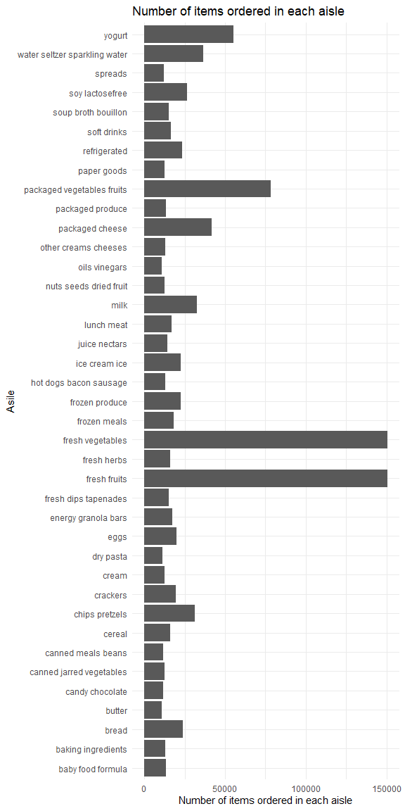
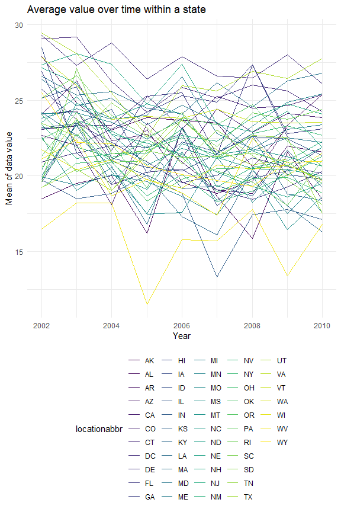
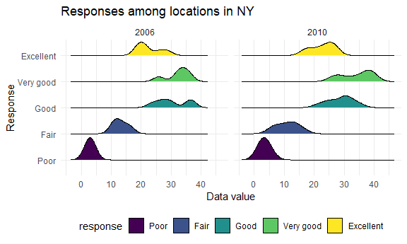
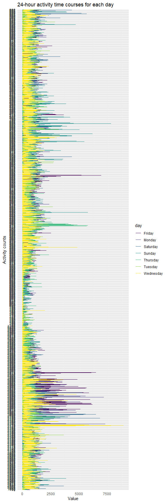

p8105\_hw3\_yz4184
================
Yunlin Zhou
10/17/2021

``` r
library(tidyverse)
```

    ## -- Attaching packages --------------------------------------- tidyverse 1.3.1 --

    ## v ggplot2 3.3.5     v purrr   0.3.4
    ## v tibble  3.1.4     v dplyr   1.0.7
    ## v tidyr   1.1.3     v stringr 1.4.0
    ## v readr   2.0.1     v forcats 0.5.1

    ## -- Conflicts ------------------------------------------ tidyverse_conflicts() --
    ## x dplyr::filter() masks stats::filter()
    ## x dplyr::lag()    masks stats::lag()

``` r
library(ggridges)
library(dplyr)

knitr::opts_chunk$set(
  fig.width = 6,
  fig.asp = .6,
  out.width = "90%"
)

theme_set(theme_minimal() + theme(legend.position = "bottom"))

options(
  ggplot2.continuous.colour = "viridis",
  ggplot2.continuous.fill = "viridis"
)

scale_colour_discrete = scale_colour_viridis_d
scale_fill_discrete = scale_fill_viridis_d
```

# Problem 1

``` r
library(p8105.datasets)
data("instacart")
```

``` r
# description of the dataset
str(instacart)
```

    ## tibble [1,384,617 x 15] (S3: tbl_df/tbl/data.frame)
    ##  $ order_id              : int [1:1384617] 1 1 1 1 1 1 1 1 36 36 ...
    ##  $ product_id            : int [1:1384617] 49302 11109 10246 49683 43633 13176 47209 22035 39612 19660 ...
    ##  $ add_to_cart_order     : int [1:1384617] 1 2 3 4 5 6 7 8 1 2 ...
    ##  $ reordered             : int [1:1384617] 1 1 0 0 1 0 0 1 0 1 ...
    ##  $ user_id               : int [1:1384617] 112108 112108 112108 112108 112108 112108 112108 112108 79431 79431 ...
    ##  $ eval_set              : chr [1:1384617] "train" "train" "train" "train" ...
    ##  $ order_number          : int [1:1384617] 4 4 4 4 4 4 4 4 23 23 ...
    ##  $ order_dow             : int [1:1384617] 4 4 4 4 4 4 4 4 6 6 ...
    ##  $ order_hour_of_day     : int [1:1384617] 10 10 10 10 10 10 10 10 18 18 ...
    ##  $ days_since_prior_order: int [1:1384617] 9 9 9 9 9 9 9 9 30 30 ...
    ##  $ product_name          : chr [1:1384617] "Bulgarian Yogurt" "Organic 4% Milk Fat Whole Milk Cottage Cheese" "Organic Celery Hearts" "Cucumber Kirby" ...
    ##  $ aisle_id              : int [1:1384617] 120 108 83 83 95 24 24 21 2 115 ...
    ##  $ department_id         : int [1:1384617] 16 16 4 4 15 4 4 16 16 7 ...
    ##  $ aisle                 : chr [1:1384617] "yogurt" "other creams cheeses" "fresh vegetables" "fresh vegetables" ...
    ##  $ department            : chr [1:1384617] "dairy eggs" "dairy eggs" "produce" "produce" ...
    ##  - attr(*, "spec")=
    ##   .. cols(
    ##   ..   order_id = col_integer(),
    ##   ..   product_id = col_integer(),
    ##   ..   add_to_cart_order = col_integer(),
    ##   ..   reordered = col_integer(),
    ##   ..   user_id = col_integer(),
    ##   ..   eval_set = col_character(),
    ##   ..   order_number = col_integer(),
    ##   ..   order_dow = col_integer(),
    ##   ..   order_hour_of_day = col_integer(),
    ##   ..   days_since_prior_order = col_integer(),
    ##   ..   product_name = col_character(),
    ##   ..   aisle_id = col_integer(),
    ##   ..   department_id = col_integer(),
    ##   ..   aisle = col_character(),
    ##   ..   department = col_character()
    ##   .. )

``` r
# there are 1,384,617 rows and 15 columns in this dataset. 4 character columns and 11 integer columns. there are key variables like aisle which is the name of aisles, and product_name which are the names of products bought from the asile.
```

``` r
# How many aisles are there

aisles_cate = unique(instacart$aisle)
aisles_num = length(aisles_cate)
aisles_num
```

    ## [1] 134

``` r
# 134

# Which aisles are the most items ordered from?

head(instacart %>% 
    count(aisle) %>% 
    arrange(desc(n)),1)
```

    ## # A tibble: 1 x 2
    ##   aisle                 n
    ##   <chr>             <int>
    ## 1 fresh vegetables 150609

``` r
# fresh vegetables
```

``` r
# Make a plot that shows the number of items ordered in each aisle

item_asile = instacart %>% 
    count(aisle) %>% 
    arrange(desc(n))

item_asile_10000 = item_asile %>%
  filter(n > 10000)

item_asile_plot =ggplot(item_asile_10000, aes(x = n, y = aisle))+
  geom_col()+
  labs(
    title = "Number of items ordered in each aisle",
    x = "Number of items ordered in each aisle",
    y = "Asile"
  )

ggsave("item_asile_plot.pdf")
```

    ## Saving 6 x 12 in image

``` r
item_asile_plot
```



``` r
# Make a table showing the three most popular items in each of the aisles

baking_df = head(instacart%>%
filter(aisle=="baking ingredients")%>%
  group_by(aisle,product_name)%>%
  count()%>%
  arrange(desc(n)),3)

dog_df = head(instacart%>%
filter(aisle=="dog food care")%>%
  group_by(aisle,product_name)%>%
  count()%>%
  arrange(desc(n)),3)

packaged_df = head(instacart%>%
filter(aisle=="packaged vegetables fruits")%>%
  group_by(aisle,product_name)%>%
  count()%>%
  arrange(desc(n)),3)

popular_items = bind_rows(baking_df,dog_df,packaged_df)
knitr::kable(popular_items)
```

| aisle                      | product\_name                                 |    n |
|:---------------------------|:----------------------------------------------|-----:|
| baking ingredients         | Light Brown Sugar                             |  499 |
| baking ingredients         | Pure Baking Soda                              |  387 |
| baking ingredients         | Cane Sugar                                    |  336 |
| dog food care              | Snack Sticks Chicken & Rice Recipe Dog Treats |   30 |
| dog food care              | Organix Chicken & Brown Rice Recipe           |   28 |
| dog food care              | Small Dog Biscuits                            |   26 |
| packaged vegetables fruits | Organic Baby Spinach                          | 9784 |
| packaged vegetables fruits | Organic Raspberries                           | 5546 |
| packaged vegetables fruits | Organic Blueberries                           | 4966 |

``` r
# Make a table showing the mean hour of the day at which Pink Lady Apples and Coffee Ice Cream are ordered on each day of the week

instacart%>%
  filter(days_since_prior_order == 0,
         product_name %in% c("Pink Lady Apples","Coffee Ice Cream"))%>%
  mutate(
    mean_hour=mean(order_hour_of_day))%>%
  select(product_name,mean_hour)%>%
  knitr::kable()
```

| product\_name    | mean\_hour |
|:-----------------|-----------:|
| Pink Lady Apples |   13.14286 |
| Pink Lady Apples |   13.14286 |
| Pink Lady Apples |   13.14286 |
| Pink Lady Apples |   13.14286 |
| Coffee Ice Cream |   13.14286 |
| Pink Lady Apples |   13.14286 |
| Coffee Ice Cream |   13.14286 |

## Problem 2

``` r
data("brfss_smart2010")
```

``` r
# do some data cleaning

brfss_new = 
  brfss_smart2010 %>%
  janitor::clean_names() %>% 
  filter(
    topic == "Overall Health",
    response %in% 
      c("Poor","Fair","Good","Very good","Excellent"))%>%
  mutate(response = 
           factor(response,levels =
           c("Poor","Fair","Good","Very good","Excellent"),
                  ordered = TRUE))%>%
  arrange(response)
```

``` r
# In 2002, which states were observed at 7 or more locations?

df_2002 = brfss_new%>%
  filter(year=="2002")%>%
  group_by(locationabbr)%>%
  summarise(
    location_num = n_distinct(locationdesc)
  )%>%
  filter(location_num>=7)

  knitr::kable(df_2002)
```

| locationabbr | location\_num |
|:-------------|--------------:|
| CT           |             7 |
| FL           |             7 |
| MA           |             8 |
| NC           |             7 |
| NJ           |             8 |
| PA           |            10 |

``` r
# In 2010

df_2010 = brfss_new%>%
  filter(year=="2010")%>%
 group_by(locationabbr)%>%
  summarise(
    location_num = n_distinct(locationdesc)
  )%>%
  filter(location_num>=7)

  knitr::kable(df_2010)
```

| locationabbr | location\_num |
|:-------------|--------------:|
| CA           |            12 |
| CO           |             7 |
| FL           |            41 |
| MA           |             9 |
| MD           |            12 |
| NC           |            12 |
| NE           |            10 |
| NJ           |            19 |
| NY           |             9 |
| OH           |             8 |
| PA           |             7 |
| SC           |             7 |
| TX           |            16 |
| WA           |            10 |

``` r
#  averages the data_value across locations within a state

brfss_new%>%
  filter(response == "Excellent")%>%
  group_by(year,locationabbr)%>%
  mutate(mean_data_value = mean(data_value))%>%
  group_by(year,locationabbr,mean_data_value)%>%
  summarize()%>%
  
  ggplot(aes(x= year,y=mean_data_value,group = locationabbr,color = locationabbr))+geom_line() + 
  labs(
    title = "Average value over time within a state",
    x = "Year",
    y = "Mean of data value"
  )
```

    ## `summarise()` has grouped output by 'year', 'locationabbr'. You can override using the `.groups` argument.

    ## Warning: Removed 3 row(s) containing missing values (geom_path).



``` r
# Make a two-panel plot

brfss_new %>%
  filter(year%in%c("2006","2010"),
         locationabbr == "NY")%>%
  group_by(year,response,data_value)%>%
  summarize()%>%
  ggplot(aes(x=data_value, y = response,fill = response))+geom_density_ridges(scale =0.85)+ facet_grid(. ~ year) + 
  labs(
    title = "Responses among locations in NY",
    x = "Data value",
    y = "Response"
  )
```

    ## `summarise()` has grouped output by 'year', 'response'. You can override using the `.groups` argument.

    ## Picking joint bandwidth of 1.82

    ## Picking joint bandwidth of 2.14



## Problem 3

``` r
# Load, tidy, and otherwise wrangle the data

accel_df = read.csv("./accel_data.csv")%>%
  janitor::clean_names()%>%
  pivot_longer(activity_1:activity_1440,
    names_to = "activity_counts",
    names_prefix = "activity_")%>%
  mutate(day = factor(day),
    week_day_end =  case_when(
      day %in% c("Monday","Tuesday","Wednsday","Thursday","Friday")~ "weekday",
      day %in% c("Saturday","Sunday") ~ "weekend",
      TRUE      ~ ""
    ))
```

``` r
# aggregate accross minutes to create a total activity variable for each day

each_day =accel_df%>%
  group_by(week,day)%>%
  mutate(sum = sum(value))%>%
  group_by(week,day,sum)%>%
  summarize()%>%
  pivot_wider(names_from = day,
              values_from = sum)
```

    ## `summarise()` has grouped output by 'week', 'day'. You can override using the `.groups` argument.

``` r
knitr::kable(each_day)
```

| week |   Friday |    Monday | Saturday | Sunday | Thursday |  Tuesday | Wednesday |
|-----:|---------:|----------:|---------:|-------:|---------:|---------:|----------:|
|    1 | 480542.6 |  78828.07 |   376254 | 631105 | 355923.6 | 307094.2 |    340115 |
|    2 | 568839.0 | 295431.00 |   607175 | 422018 | 474048.0 | 423245.0 |    440962 |
|    3 | 467420.0 | 685910.00 |   382928 | 467052 | 371230.0 | 381507.0 |    468869 |
|    4 | 154049.0 | 409450.00 |     1440 | 260617 | 340291.0 | 319568.0 |    434460 |
|    5 | 620860.0 | 389080.00 |     1440 | 138421 | 549658.0 | 367824.0 |    445366 |

``` r
# the values would be smaller during the weekends
```

``` r
# Accelerometer data allows the inspection activity over the course of the day.

accel_df%>%
  ggplot(aes(x=value,y=activity_counts, color = day))+geom_line()+
  labs(title = "24-hour activity time courses for each day",
       x = "Value",
       y = "Activity counts")+
  theme(legend.position = "right")
```


